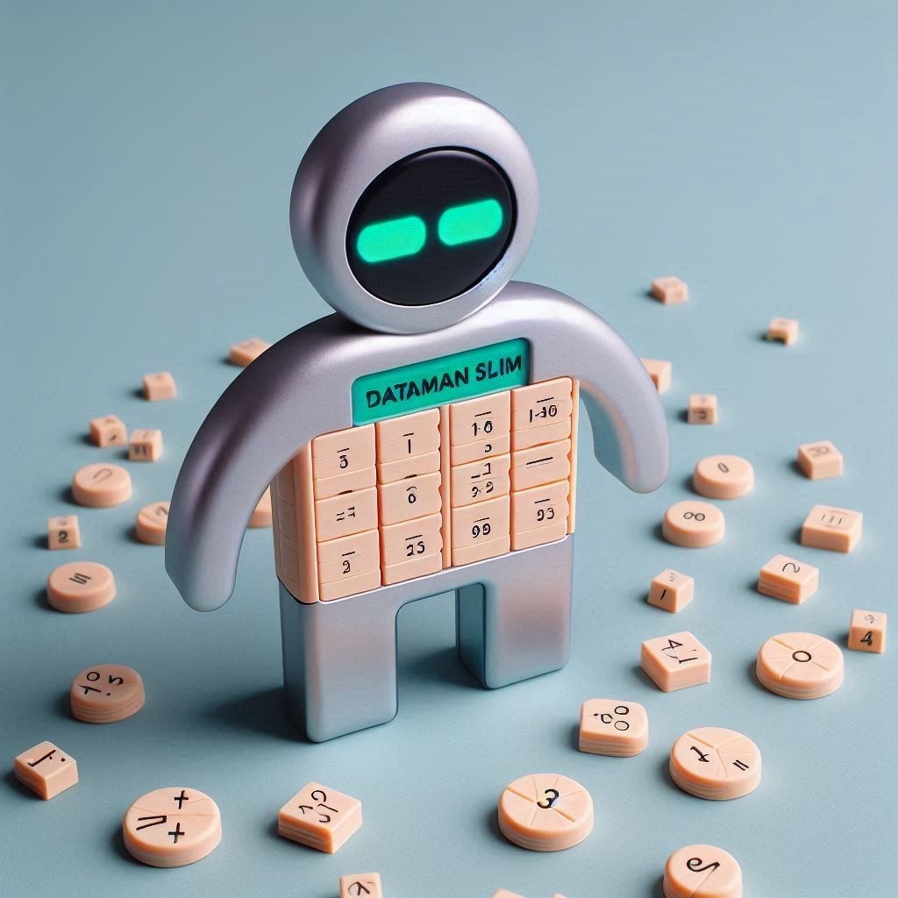

# Creative Brief for DataMan Slim
</img>
## 1. Brand Overview

**Company/Organization Name:** DataMan Toys

**Industry/Sector:** EdTech

**Mission Statement:** To make learning math fun and engaging for kids through innovative, user-friendly technology.

**Brand History:** Founded by a group of educators and technologists who wanted to create an educational toy that combines learning with fun. Inspired by their own children's struggles with traditional math learning methods.

**Core Values:** Innovation, User Empowerment, Accessibility, Fun

**Target Audience:** Parents of young children, educators, and kids aged 5-12

## 2. Brand Identity

**Brand Essence:** Fun learning

**Key Attributes to Communicate:**
- User-friendly interface
- Cutting-edge technology
- Reliability

**Emotional Response to Evoke:** Excited, Engaged

**Visual Style Direction:** Futuristic and minimalistic

**Brand Voice and Tone:** Professional but approachable

**Brand Personality:** Innovative and supportive

## 3. Product/Service Information

**Main Offerings:**
- Toy for kids to help them learn math
- Features an answer checker and a memory bank function

**Unique Selling Proposition (USP):** The only math learning toy that combines futuristic design with a comfortable, easy-to-handle experience and a minimalistic interface.

**Key Benefits:** Enhance math skills, Make learning fun, Easy to use

## 4. Market Analysis

**Competitors:** Other educational toys, Traditional math learning tools

**Market Position:** A premium product for tech-savvy parents and educators

**SWOT Analysis:**
- **Strengths:** High user engagement, Easy to use
- **Weaknesses:** Limited market awareness
- **Opportunities:** Growing demand for educational toys
- **Threats:** Emerging competitors

## 5. Campaign Briefs

**Campaign Option 1**

**Objective:** Increase product awareness

**Target Audience:** Parents, educators, children aged 5-12

**Key Message:** "Make math fun with DataMan Slim"

**Desired Outcome:** 50,000 toy sales in the first quarter

**Tone and Style:** Energetic and inspiring

**Specific Requirements:** Showcase the toy's interface and emphasize ease of use

## 6. Design Requirements

**Logo and Branding Guidelines:** Modern, sleek, and futuristic

**Product Packaging:** Design for a toy box that is fun and engaging

**Print Deliverables:** Posters, brochures

**Digital Deliverables:** Social media ads, email templates

**Multipage Layout:** User guide, product catalog

[Go Back](index.md)

